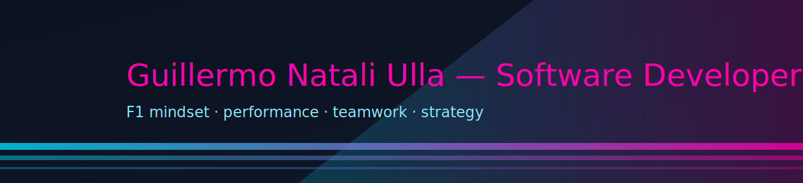

  <!-- Cyberpunk banner F1 -->
  

  

<h3 align="center">Backend Developer • Full‑stack Enthusiast • DevOps Explorer</h3>

  
  
  
  
  

---

## 📚 Sobre mí

- 🎓 **Técnico Superior en Desarrollo de Software** (graduado).
- 🏫 Actualmente cursando **4º año de Ingeniería en Sistemas** en la **Universidad Abierta Interamericana – UAI Rosario** (turno noche).
- 💻 Backend con **Django**, **Ruby on Rails** y **APIs REST**.
- 🔐 Seguridad, despliegues con **Docker/Nginx**, bases de datos **PostgreSQL/MySQL**.
- ⚡ Enfoque en **performance**, **buenas prácticas** y **DX**.

---

## 🛠️ Tech Stack

<table>
  <tr>
    <th>🔙 Backend</th>
    <th>🔧 DevOps</th>
    <th>🗄️ Database</th>
    <th>💻 Lenguajes</th>
    <th>🎨 Frontend</th>
  </tr>
  <tr>
    <td>
      
      
      
      
      
    </td>
    <td>
      
      
      
    </td>
    <td>
      
      
      
      
      
      
    </td>
    <td>
      
      
      
      
    </td>
    <td>
      
      
      
      
    </td>
  </tr>
</table>

---

## 🏎️ F1 Vibes

  
  
  

---

## 🚀 Proyectos Destacados

- **Spree Purchase Recommendations** → Extensión para Spree con recomendaciones por historial (Redis, Sidekiq, anti N+1, API lista para prod).  
  Repo: <https://github.com/guille-nat/spree_purchase_recommendations>
- **API Compras** → API REST con Django + DRF, JWT, Swagger/ReDoc y automatizaciones de comprobantes.  
  Repo: <https://github.com/guille-nat/Api_Compras>

---

## 🐍 Snake Contributions
>
> Este gráfico se genera automáticamente cada día con otro workflow.

  

  

---

## 📅 Efemérides de la Programación
<!--EFEMERIDES_START-->
No hay efemérides para el día de hoy (12-29). La efeméride anterior más cercana es del **12-11**:
- 1995: Se lanza el lenguaje de programación **JavaScript** para Netscape Navigator.
<!--EFEMERIDES_END-->

> *Se actualiza automáticamente todos los días vía GitHub Actions.*

---

## 📊 Stats

  
  

  

---

## 🤝 Conectemos

- 📧 **Email:** [guillermonatali22@gmail.com](mailto:guillermonatali22@gmail.com)
- 💼 **LinkedIn:** [Guillermo Natali Ulla](https://www.linkedin.com/in/guillermo-natali-ulla-550469220/)
- 🌐 **Portfolio:** [nataliullacoder.com](https://nataliullacoder.com/)
- 💬 **Discord:** GUILLEN.U#9592
